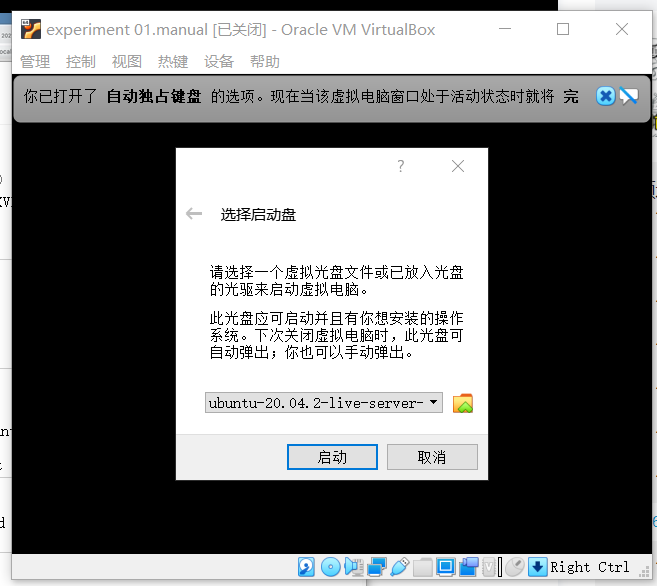

# **Focal Fossa无人值守安装iso制作过程示例**

## **手动安装Ubuntu 20.04**

+ 提前下载好纯净版Ubuntu安装镜像iso文件（ubuntu-20.04.2-live-server-amd64.iso）

+ 校验下载好的文件，并与官网镜像文件的校验值进行比对

+ 右键官网下载链接中的SHA256SUMS，在新页面中打开链接；

+ 启动Win10自带的PowerShell，输入“*Get-FileHash "D:\linux\ubuntu-20.04.2-live-server-amd64.iso" | Format-List*”，即“*Get-FileHash 文件路径 | Format-List*”格式

+ 比对两者

+ 开始手动安装Ubuntu

+ 修改动态分配的内存大小

+ 修改网络设置，启用 Host-only 网卡

+ 修改存储设置，添加之前下载好的镜像

+ 启动

+ 定制普通用户名和默认密码

+ 定制安装OpenSSH Sever

+ 完成手动安装

---

## **制作iso镜像文件**

+ 主机链接手动安装的那台虚拟机 *ssh xyn@192.168.56.106*

+ 获取文件 *cat /var/log/installer/autoinstall-user-data*

+ 修改autoinstall-user-data

+ 新建空白文件meta-data，将获取并修改后的autoinstall-user-data重命名为user-data，与meta-data一起导入虚拟机

+ 新建network-config文件，文件内容如图；并将该文件导入虚拟机

+ 重新链接虚拟机，执行图示操作

+ 将制作好的init.iso导出到主机（查找主机ip地址的命令行如图）

---

## **无人值守安装**

+ 开始无人值守安装Ubuntu

+ 修改动态分配内存大小

+ 修改存储设置移除当前的控制器

+ 先挂载纯净版Ubuntu安装镜像iso文件

+ 再挂载制作好的光盘镜像 init.iso

+ 修改网络设置

+ 启动进行安装，需要输入一次yes

+ 完成安装！

---

## **遇到的问题**

+ 无法将user-data和meta-data和network-config导入进虚拟机；也无法将init.iso导出虚拟机

#### 解决方式：查阅网络，通过scp方式在虚拟机和主机之间传输文件，具体方式如图所示

---

## **实验问题**

1、 如何配置无人值守安装iso并在Virtualbox中完成自动化安装？

+ 解决方式：先进行手动安装，获取手动安装产生的系统文件autoinstall-user-data，稍加修改用于制作无人值守安装的iso镜像，该镜像中包含手动安装过程中选择的各项信息

2、 Virtualbox安装完Ubuntu之后新添加的网卡如何实现系统开机自动启用和自动获取IP？

+ 解决方法：修改00-installer-config.yaml文件，如下图所示

3、 如何使用sftp在虚拟机和宿主机之间传输文件？

+ 解决方式：通过sftp guestname@guest_ip 链接虚拟机，再分别通过get、put命令从虚拟机获取文件、传送文件到虚拟机（以下图为例）

