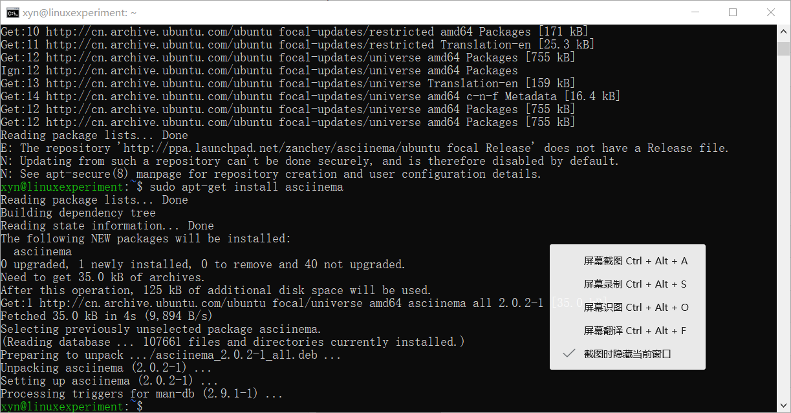
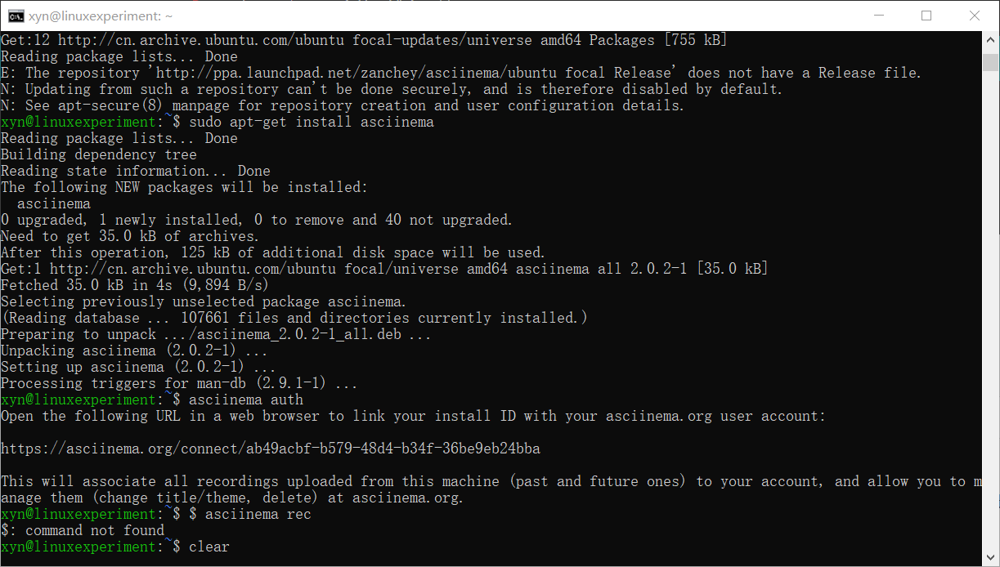

# 实验任务

1. 学习vimtutor

2. 通过asciinema上传学习录屏

3. 完成自查清单

# 实验步骤

## 安装asciinema

1. 通过ssh连接到虚拟机中的ubuntu系统





2. 根据as与ciinema官网安装教程中Installing in Linux下的Ubuntu对应操作安装asiciinema（具体代码如下）

```
    sudo apt-add-repository ppa:zanchey/asciinema
    sudo apt-get update
    sudo apt-get install asciinema
```

3. 键入如下指令将asciinema与本地账号以及在线账号相互关联

`asciinema auth`

## 开始学习vimtutor

1. lesson1.1-1.6

[](https://asciinema.org/a/j90c83Mitvu73rCZ7ugdGbS8E)

2. lesson2.1-2.7

[](https://asciinema.org/a/9bEGthlg1EOVD4I2FfcZwndBP)

3. lesson3.1-3.4

[](https://asciinema.org/a/tXQHNa6gT7vm5CcDDI81Sq75j)

4. lesson4.1-4.4

[](https://asciinema.org/a/aEia0PPLQjTlyuakfYYJzdprI)

5. lesson5.1-5.4

[](https://asciinema.org/a/pvjji6XQlMZkgzq4LUCHE82mL)

6. lesson6.1-6.5

[](https://asciinema.org/a/PA4EbF1rEq4fm0C5U9jYoY18w)

7. lesson7.1-7.3

[](https://asciinema.org/a/DDjoeIZoMw3IH4klJbxHXNnM8)

## vimtutor完成后的自查清单

1. 你了解vim有哪几种工作模式？

- normal-mode

- insert-mode

- visual-mode

- command-mode

2. Normal模式下，从当前行开始，一次向下移动光标10行的操作方法？如何快速移动到文件开始行和结束行？如何快速跳转到文件中的第N行？

- 通过10+j

- 通过gg快速移动到文件开始行；通过G快速移动到文件结束行

- 通过行数+G快速跳转到文件中的第N行

3. Normal模式下，如何删除单个字符、单个单词、从当前光标位置一直删除到行尾、单行、当前行开始向下数N行？

- 通过x删除单个字符

- 通过dw删除单个单词

- 通过d$从当前光标位置一直删除到行尾

- 通过dd删除单行

- 通过行数+dd删除当前行开始向下数N行

4. 如何在vim中快速插入N个空行？如何在vim中快速输入80个-？

- 通过N+o/O在vim中快速插入N个空行

- 通过80i- + esc快速输入80个-

5. 如何撤销最近一次编辑操作？如何重做最近一次被撤销的操作？

- 通过u撤销最近一次编辑操作

- 通过CTRL+R重做最近一次被撤销的操作

6. vim中如何实现剪切粘贴单个字符？单个单词？单行？如何实现相似的复制粘贴操作呢？

- 光标放置在想要剪切的字符上按x，再放在想要粘贴的位置前面按p

- 光标放置在想要剪切的单词首字母上按dw，再放在想要粘贴的位置前面按p

- 光标放在想要剪切的单行上按dd，再放在想要粘贴的位置按p

- 按v进入visual-mode，移动光标进行选择，按y进行复制，按p进行粘贴

7. 为了编辑一段文本你能想到哪几种操作方式（按键序列）？

- 按x删除文本，按i输入文本，按p粘贴删除的文本，按r替换要修改的文本，按a在光标位置之后插入文本，按A在光标所在行的行末插入文本

8. 查看当前正在编辑的文件名的方法？查看当前光标所在行的行号的方法？

- 通过CTRL+G

9. 在文件中进行关键词搜索你会哪些方法？如何设置忽略大小写的情况下进行匹配搜索？如何将匹配的搜索结果进行高亮显示？如何对匹配到的关键词进行批量替换？

- /关键词 进行检索

- :set ic 忽略大小写

- :set hls is 进行高亮显示

- :%s/被替换词/替换词/g  替换所有被替换词

10. 在文件中最近编辑过的位置来回快速跳转的方法？

- CTRL+O向前跳转

- CTRL+I向后跳转

11. 如何把光标定位到各种括号的匹配项？例如：找到(, [, or {对应匹配的),], or }

- 光标放在括号上，通过%找到对应的括号

12. 在不退出vim的情况下执行一个外部程序的方法？

- :!+外部程序名

13. 如何使用vim的内置帮助系统来查询一个内置默认快捷键的使用方法？如何在两个不同的分屏窗口中移动光标？

- :help+快捷键名称 

- ctrl + w + h 向右

- ctrl + w + j 向下

- ctrl + w + k 向上

- ctrl + w + l 向左